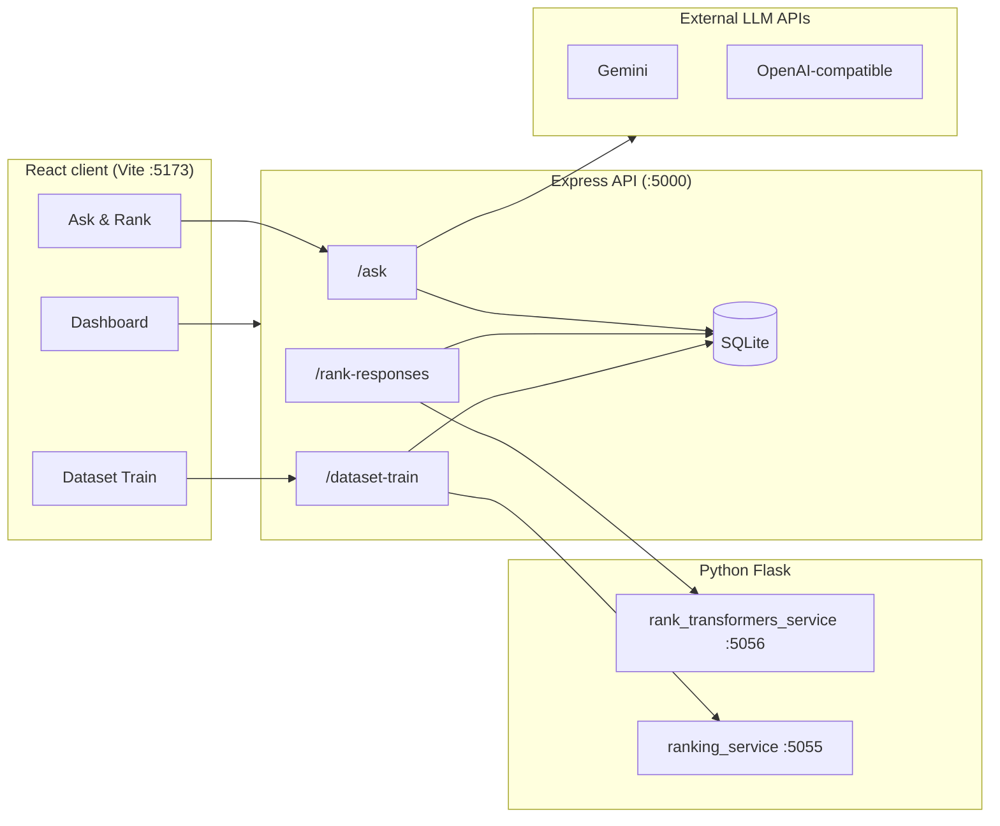

# LLM Ranker (F25-213)

A full-stack web application to **query multiple LLMs on the same prompt**, **automatically rank their responses**, **save query history in SQLite**, and **train or score uploaded datasets** (CSV/XLSX) using Python CrossEncoder services.

---

## Table of contents

1. [Project overview](#project-overview)
2. [How the workflow works](#how-the-workflow-works)
3. [Architecture](#architecture)
4. [Requirements](#requirements)
5. [Quick start (setup and run)](#quick-start-setup-and-run)
6. [Environment configuration](#environment-configuration)
7. [Using the application](#using-the-application)
8. [Manual run (any OS)](#manual-run-any-os)
9. [Useful commands](#useful-commands)
10. [API overview](#api-overview)
11. [Troubleshooting](#troubleshooting)

---

## Project overview

| Folder | Purpose |
|--------|---------|
| `client/` | React + Vite frontend — ask questions, view ranked results, dashboard, dataset training, charts |
| `server/` | Express (Node.js) API — `/ask`, ranking, query history, authentication, dataset training |
| `server/python/` | Flask Python services — CrossEncoder ranking (ports **5055** and **5056**) |
| `scripts/` | Windows startup script (`start-project.ps1`) |

---

## How the workflow works

### 1. Ask multiple LLMs (live query flow)

1. User enters a **query** in the UI and selects which **LLM models** to use (panel slots 1–30; up to 5 backends can be wired in `.env`).
2. Frontend sends `POST /ask` to the Node API with `{ query, providerIndices }`.
3. Node calls each configured LLM provider in parallel (Gemini, OpenAI-compatible chat APIs, etc.).
4. Responses are saved to **SQLite** as a batch (query + each model’s answer).
5. Node ranks responses using **TF-IDF + embeddings** (weights from `TFIDF_WEIGHT` / `EMBEDDING_WEIGHT` in `.env`).
6. Ranked results are returned to the UI and stored in query history.

### 2. Re-rank with CrossEncoder (optional, stronger ranking)

1. User triggers re-ranking on stored responses via `POST /rank-responses`.
2. Node writes the batch to SQLite and calls the Python service on port **5056** (`rank_transformers_service.py`).
3. The CrossEncoder model scores each response against the query.
4. Updated scores and order are returned and persisted.

### 3. Dataset training / bulk scoring

1. User uploads a **CSV or XLSX** file with:
   - A **Query** row (the question)
   - Tables of **ID / LLM / Response** (supports multiple sheets and query blocks)
2. Frontend sends `POST /api/dataset-train` with parsed rows.
3. Node calls Python **ranking_service.py** on port **5055** for CrossEncoder scores.
4. Scores are **blended** with historical **model statistics** from SQLite when LLM names match.
5. Results appear in a modal with charts; user can export to **CSV/XLSX** or download chart PNGs as a ZIP.

### 4. Dashboard and history

- Authenticated users can view **query history**, **profile**, and **model statistics** aggregated from past runs.
- Custom drag-and-drop ranking is supported via `POST /custom-ranking`.

---

## Architecture



**Data flow summary:** UI → Node API → (LLM providers + SQLite + Python rankers) → ranked results back to UI.

---

## Requirements

| Tool | Version |
|------|---------|
| **Node.js** | 18+ (with npm) |
| **Python** | 3.10+ (with pip) |
| **OS** | Windows recommended (includes one-command startup); macOS/Linux supported via manual run |
| **CUDA** | Optional — PyTorch falls back to CPU; first Python run may download Hugging Face model weights |
| **API keys** | At least one LLM provider key in `server/.env` to get live answers |

---

## Quick start (setup and run)

Follow these steps from a terminal (PowerShell on Windows).

### Step 1 — Get the project

If you already have the folder, open a terminal in the **repository root** (the folder that contains `client/`, `server/`, and `scripts/`).

```powershell
cd "C:\path\to\LLM-RANKER"
```

### Step 2 — Install dependencies

```powershell
# Backend (Node)
cd server
npm install
cd ..

# Frontend (React)
cd client
npm install
cd ..

# Python rankers
cd server\python
pip install -r requirements.txt
cd ..\..
```

### Step 3 — Configure environment

```powershell
# Copy example env files (run from repo root)
copy server\.env.example server\.env
copy server\python\.env.example server\python\.env
```

Edit **`server/.env`**:

- Set `PORT=5000` (or your preferred port).
- Add at least one provider block, e.g. `API1_NAME`, `API1_URL`, `API1_KEY`, `API1_MODEL` (see [`server/PROVIDERS.md`](server/PROVIDERS.md)).
- Confirm these URLs match the Python services:
  - `RANK_TRANSFORMERS_SERVICE_URL=http://127.0.0.1:5056`
  - `RANKING_SERVICE_URL=http://127.0.0.1:5055`

Edit **`server/python/.env`** only if you need a private Hugging Face model (`HF_TOKEN` or `HUGGING_FACE_HUB_TOKEN`).

### Step 4 — Start everything (Windows)

From the **repository root**:

```powershell
.\scripts\start-project.ps1
```

Or double-click / run:

```powershell
.\start-project.cmd
```

This opens **four terminal windows**:

| # | Service | Port | Role |
|---|---------|------|------|
| 1 | `rank_transformers_service.py` | 5056 | CrossEncoder re-ranking from SQLite |
| 2 | `ranking_service.py` | 5055 | Dataset train / bulk scoring |
| 3 | Node API (`node index.js`) | 5000 | Main backend |
| 4 | Vite dev server | 5173 | React UI |

### Step 5 — Open the app

1. In the **Vite** window, note the local URL (usually **http://localhost:5173**).
2. Open that URL in your browser.
3. Register or log in, then go to **Home** to ask a question and compare LLM responses.

### Step 6 — Verify services (optional)

| Check | URL |
|-------|-----|
| Node API | http://127.0.0.1:5000/health |
| Dataset ranker | http://127.0.0.1:5055/health |
| Batch ranker | http://127.0.0.1:5056/health |

**Stop the project:** close all four terminal windows, or free ports 5000, 5055, 5056, and 5173 if a process is stuck.

**Skip Python** (ranking uses placeholder scores only):

```powershell
.\scripts\start-project.ps1 -SkipPython
```

---

## Environment configuration

### `server/.env`

Main configuration file. Key settings:

| Variable | Description |
|----------|-------------|
| `PORT` | Node API port (default **5000**) |
| `API1_*` … `API5_*` | LLM provider name, URL, key, model, request type |
| `RANK_TRANSFORMERS_SERVICE_URL` | Python batch ranker (default **5056**) |
| `RANKING_SERVICE_URL` | Python dataset ranker (default **5055**) |
| `TFIDF_WEIGHT` / `EMBEDDING_WEIGHT` | Blend for initial ranking in `/ask` |
| `EMBEDDINGS_API_URL` / `EMBEDDINGS_API_KEY` | Optional embedding API for ranking |

Full provider mapping: [`server/PROVIDERS.md`](server/PROVIDERS.md).  
Optional model catalogue template: `server/models.env.example`.

### `server/python/.env`

Hugging Face token for private models only. Never commit real tokens.

### `client/.env` (optional)

Copy from `client/.env.example` if you need a custom API base URL in production (`VITE_API_BASE_URL`).

---

## Using the application

1. **Landing page** → Register / Log in.
2. **Home (`/home`)** → Enter a query, select models, submit → view ranked responses.
3. **Re-rank** → Use rank actions to run the CrossEncoder service on stored batches (requires Python on **5056**).
4. **Dashboard (`/dashboard`)** → Browse past queries and results.
5. **Model statistics (`/model-statistics`)** → See aggregate scores per LLM.
6. **Dataset training** → Upload CSV/XLSX with Query + ID/LLM/Response columns; view scores and export results.

---

## Manual run (any OS)

Use four terminals if you are not on Windows or prefer manual control:

```bash
# Terminal 1 — batch CrossEncoder ranker
cd server/python && python rank_transformers_service.py

# Terminal 2 — dataset train scorer
cd server/python && python ranking_service.py

# Terminal 3 — Node API
cd server && npm run start

# Terminal 4 — React UI
cd client && npm run dev
```

Ensure `server/.env` URLs point to the ports you actually use.

---

## Useful commands

```bash
# Clear local SQLite data (from server folder)
cd server
npm run db:clear

# Production build of the frontend
cd client
npm run build
```

---

## API overview

| Method | Path | Description |
|--------|------|-------------|
| `GET` | `/health` | API liveness |
| `GET` | `/providers` | Public model catalogue (no secrets) |
| `POST` | `/ask` | Query multiple LLMs and rank |
| `POST` | `/rank-responses`, `/api/rank-responses` | CrossEncoder re-rank |
| `POST` | `/custom-ranking`, `/api/custom-ranking` | User-defined order |
| `POST` | `/api/dataset-train`, `/dataset-train` | Score uploaded dataset |

---

## Troubleshooting

| Problem | What to try |
|---------|-------------|
| “No models with API keys” | Fill `API*_KEY` (and `NAME` + `URL`) in `server/.env` |
| Python window errors on first run | Wait for Hugging Face model download; check `pip install -r requirements.txt` |
| Port already in use | Stop old processes on 5000, 5055, 5056, or 5173 |
| Ranking shows placeholder scores | Start Python services or remove `-SkipPython` |
| CORS / API errors in browser | Keep Vite dev server running; API should be on port 5000 |

---

## Git / secrets

Do **not** commit `server/.env`, `server/python/.env`, `node_modules/`, or local `*.db` files. Only share `*.example` templates. See [`.gitignore`](.gitignore).

---

## License

No root license file is set in this repository; clarify with the authors before redistributing.
